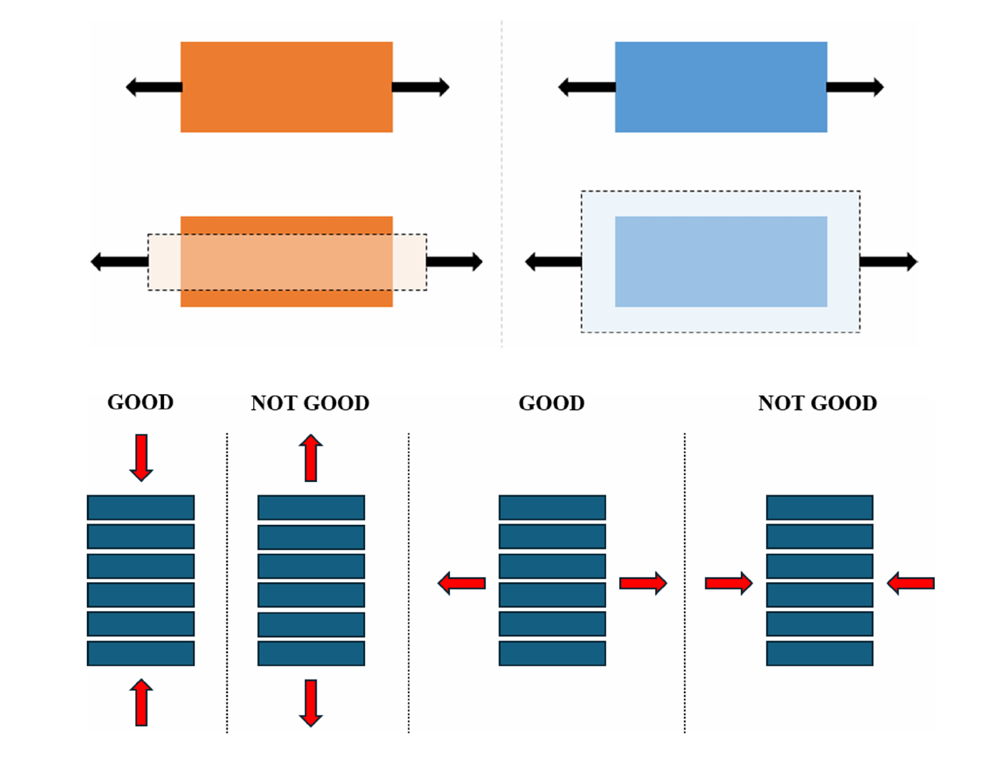
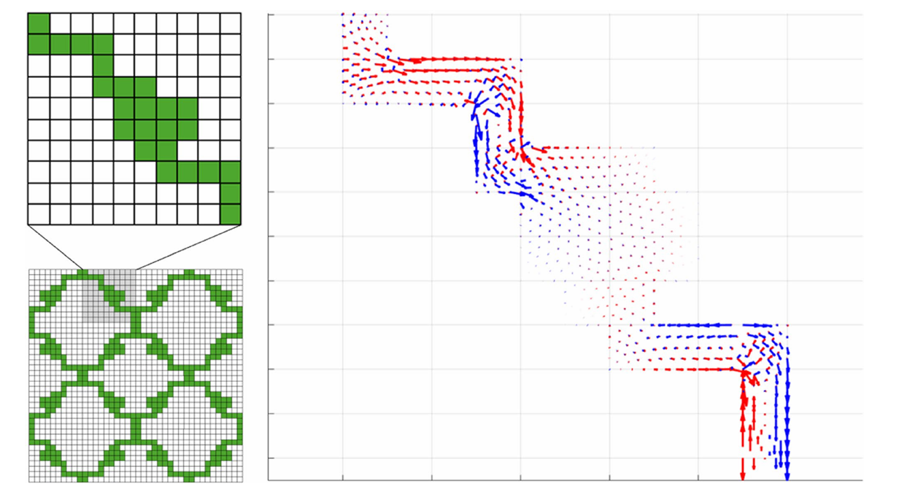
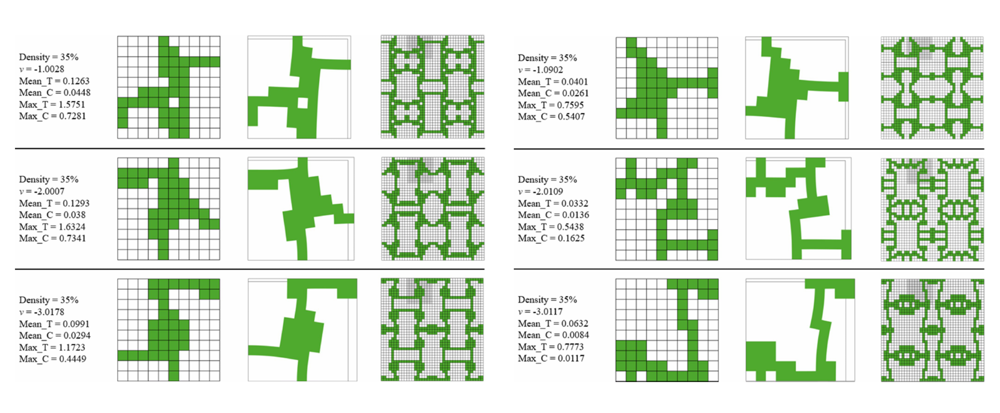
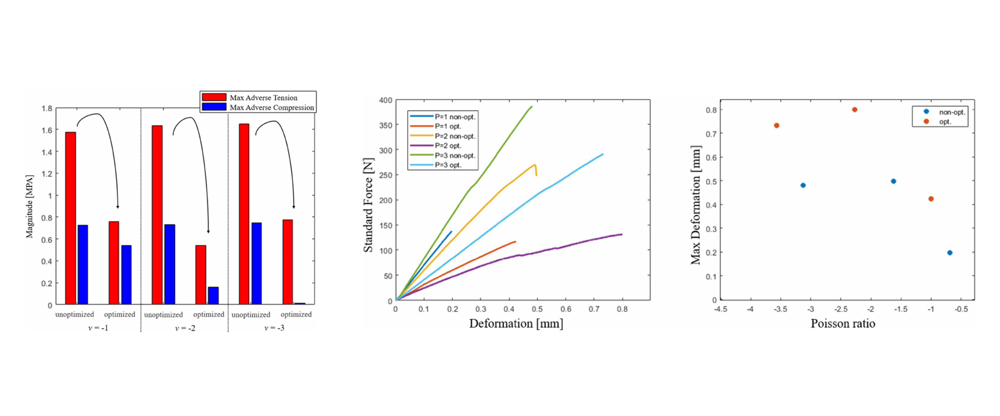

# Anisotropy-aware auxetic metamaterial design with evolutionary optimization

This repository/notebook explains and reconstructs the main workflow from my article:

> **Anisotropy-aware design of auxetic metamaterials via multi-objective evolutionary optimization**  
> Márton Tamás Birosz, János Hegedűs-Kuti, Mátyás Andó  
> *Engineering with Computers*, 2026, 42:13  
> DOI: `10.1007/s00366-025-02266-1`

The goal of the work is to generate **2D auxetic metamaterial unit cells** that can reach a prescribed negative Poisson's ratio while also taking into account the **anisotropic mechanical behaviour introduced by FDM additive manufacturing**.

In simple terms: I wanted the optimization algorithm to create auxetic geometries that are not only mathematically interesting, but also more realistic for 3D printing, where the layer direction can strongly influence stiffness, deformation, and failure.

---

## Why this problem matters

Auxetic metamaterials are structures with a **negative Poisson's ratio**. Instead of contracting laterally when stretched, they expand in the transverse direction. This behaviour is usually not caused by the base material itself, but by the geometry of the unit cell.

Such structures are useful when deformation control, energy absorption, flexibility, or impact resistance are important. However, many optimized auxetic designs are created under idealized assumptions. In real FDM printing, the structure is built layer by layer, and this introduces mechanical anisotropy. Loads acting perpendicular to the layers can be especially problematic because the interlayer bonding is usually weaker than the in-plane material response.



**Figure:** The top part contrasts conventional and auxetic lateral deformation. The bottom part shows why FDM anisotropy matters: loading relative to the layer direction can create favourable or unfavourable stress states. This was one of the main motivations for adding anisotropy-aware objectives to the optimization loop.

---

## Main idea of the notebook

The notebook follows the same conceptual pipeline as the article:

1. Generate candidate unit-cell geometries on a 2D grid.
2. Keep only geometries that satisfy connectivity and edge-preservation constraints.
3. Convert the geometry into an FEA-ready representation.
4. Evaluate displacement, stress fields, and Poisson's ratio using finite element analysis.
5. Use a multi-objective evolutionary algorithm to mutate and improve the best geometries.
6. Compare standard Poisson-ratio-only designs with anisotropy-aware designs.
7. Validate the optimized structures through 3D printing and tensile testing.

The workflow is intentionally mutation-based. I did not use crossover because, under strict connectivity and boundary constraints, crossover often creates disconnected or invalid lattice geometries.

---

## Methodology overview

### 1. Unit-cell generation with graph theory

The geometry is represented as a set of active points on a fixed 2D lattice. Each point is interpreted as a graph node, and neighbouring points are connected by graph edges.

The main feasibility rules are:

- the remaining lattice must form a single connected component;
- at least one point must remain on each boundary of the quarter cell;
- deleted or mutated points cannot break the load path;
- after mirroring and repetition, the geometry must remain manufacturable as a periodic auxetic pattern.

For connectivity checking, I used a depth-first search logic:

```python
def is_connected(points, grid_step=1):
    """Check whether all active lattice points belong to one connected component."""
    points = set(points)
    if not points:
        return False

    start = next(iter(points))
    visited = set()
    stack = [start]

    while stack:
        p = stack.pop()
        if p in visited:
            continue
        visited.add(p)

        x, y = p
        neighbours = [
            (x + grid_step, y),
            (x - grid_step, y),
            (x, y + grid_step),
            (x, y - grid_step),
        ]
        stack.extend([q for q in neighbours if q in points and q not in visited])

    return len(visited) == len(points)
```

This step is important because the optimizer should not waste FEA calls on geometries that are already mechanically meaningless.

---

### 2. Mutation and repair

The evolutionary algorithm modifies existing geometries through pointwise mutation. A mutated point is moved to another unoccupied grid position. After mutation, the geometry is repaired if necessary.


The simplified mutation-repair logic is:

```python
def mutate_geometry(points, grid_nodes, mutation_probability=0.3):
    """Mutate a lattice geometry while keeping the number of active points constant."""
    points = list(points)
    occupied = set(points)
    new_points = points.copy()

    selected = [i for i in range(len(points)) if random.random() < mutation_probability]
    if len(selected) == 0:
        selected = [random.randrange(len(points))]

    for i in selected:
        occupied.discard(new_points[i])
        free_nodes = list(set(grid_nodes) - occupied)
        new_location = random.choice(free_nodes)
        new_points[i] = new_location
        occupied.add(new_location)

    return repair_geometry(new_points, grid_nodes)
```

The repair stage enforces:

- boundary presence on all four sides;
- sufficient local neighbourhood for non-edge points;
- global graph connectivity.

This makes the algorithm more robust because it can explore new geometries without constantly producing invalid candidates.

---

### 3. Finite element analysis

Each valid geometry is converted into an FEA model. In the article, the implementation used MATLAB R2022a and the Partial Differential Equation Toolbox.

The FEA stage computes:

- displacement field;
- simulated Poisson's ratio;
- principal stress magnitudes;
- principal stress directions;
- adverse stress components related to FDM anisotropy.

The stress orientation is important because the printed structure does not behave identically in every direction. I therefore evaluated not only the auxetic deformation, but also whether the stress trajectories were likely to interact unfavourably with the printing-layer direction.



**Figure:** Principal stress directions from the FEA stage. Red arrows indicate tensile principal stresses and blue arrows indicate compressive principal stresses. Their orientation is used to evaluate whether the geometry is favourable for FDM-type anisotropy.

---

## Optimization problem

Each candidate geometry is evaluated with five objectives.

Let `x` be a feasible geometry. The optimizer minimizes:

```text
f1(x) = |target_Poisson_ratio - simulated_Poisson_ratio(x)|
f2(x) = mean perpendicular tensile stress
f3(x) = mean parallel compressive stress
f4(x) = maximum perpendicular tensile stress
f5(x) = maximum parallel compressive stress
```

The first objective controls the auxetic response. The other four objectives represent the anisotropy-aware part of the design problem.

Instead of assigning arbitrary subjective weights, I normalized all objectives and selected the candidate closest to the ideal point using Euclidean distance:

```python
def normalized_distance(objective_matrix):
    """Rank candidates by their distance from the normalized ideal point."""
    mins = objective_matrix.min(axis=0)
    maxs = objective_matrix.max(axis=0)
    normalized = (objective_matrix - mins) / (maxs - mins + 1e-12)
    return np.linalg.norm(normalized, axis=1)
```

This keeps the optimization multi-objective while still allowing one representative final geometry to be selected for manufacturing and testing.

---

## Evolutionary loop

The simplified full loop is:

```python
population = initialize_population(n=100)

for generation in range(max_generations):
    results = []

    for geometry in population:
        if not is_feasible(geometry):
            continue

        fea_result = run_fea(geometry)
        objectives = evaluate_objectives(fea_result)
        results.append((geometry, objectives))

    elites = select_best_candidates(results, k=10)

    next_population = []
    for elite in elites:
        next_population.append(elite)
        for _ in range(9):
            child = mutate_geometry(elite, grid_nodes, mutation_probability=0.3)
            next_population.append(child)

    population = next_population

    if has_converged(results, threshold=0.005):
        break

best_geometry = select_best_candidates(results, k=1)[0]
```

The main design choices were:

- population size: `100`;
- elite candidates per generation: `10`;
- mutation probability: `0.3`;
- convergence threshold: `0.5%` relative improvement;
- no crossover, because it frequently generated invalid disconnected geometries.

---

## What the results showed

The optimization successfully generated geometries for several target Poisson's ratios, including approximately `-1`, `-2`, and `-3`.



**Figure:** Comparison of generated geometries without anisotropy-aware objectives (left) and with anisotropy-aware objectives (right). The same target Poisson-ratio levels are shown, but the anisotropy-aware geometries reduce the adverse stress metrics while preserving auxetic behaviour.

The important observation was that optimizing only for the Poisson's ratio can produce valid auxetic geometries, but these geometries are not necessarily favourable for FDM printing. When the anisotropy-related objectives are included, the resulting structures adapt their internal force-flow paths and reduce adverse stress orientations relative to the build direction.

In practice, the anisotropy-aware geometries showed:

- reduced adverse tensile stress components;
- reduced adverse compressive stress components;
- more favourable stress trajectories;
- deformation behaviour more aligned with the intended auxetic mechanism;
- improved robustness against manufacturing-induced directional weakness.

---

## Experimental validation

The optimized and non-optimized structures were fabricated using PLA and FDM printing. The experimental part focused on two checks:

1. whether the printed geometries still showed auxetic behaviour;
2. whether anisotropy-aware optimization changed the mechanical response under tensile testing.



**Figure:** Summary of anisotropy reduction and tensile testing. The bar chart shows the reduction of maximum adverse tension and compression after anisotropy-aware optimization. The tensile plots show that the non-optimized specimens reached higher peak loads in some cases, while the optimized specimens generally showed greater deformation capacity before failure.

The experimental measurements did not perfectly match the simulated Poisson's ratios, which is expected for FDM-printed metamaterials. The main sources of deviation are printing inaccuracies, layer effects, local under-extrusion, mesh discretization, and the difference between idealized simulation assumptions and real PLA behaviour.

However, the measured values still confirmed the auxetic nature of the structures.

---

## Key takeaway

The main contribution is not simply generating auxetic patterns. The important point is that the geometry generation process explicitly considers the mechanical anisotropy caused by additive manufacturing.

My conclusion from this work is that evolutionary geometry optimization can be used as a practical design tool for auxetic metamaterials when the fitness evaluation includes both the target deformation mechanism and manufacturing-related mechanical constraints.

This makes the approach relevant for applications where lightweight, flexible, impact-resistant, or customized lattice structures are required.

---

## Limitations

The current workflow has several limitations:

- it is computationally expensive because every candidate requires FEA evaluation;
- the implementation is currently limited to 2D unit-cell geometries;
- the FDM toolpath itself is not explicitly simulated;
- surface quality and staircase effects are not directly optimized;
- experimental measurements are sensitive to printing quality and specimen geometry.

These limitations suggest clear future extensions.

---

## Future work

The next steps I would explore are:

- extending the method from 2D grids to 3D voxel-based metamaterials;
- adding toolpath-aware anisotropy models;
- replacing repeated FEA calls with surrogate models;
- applying smoothing or implicit surface reconstruction to reduce staircase effects;
- validating more geometries under controlled mechanical testing;
- integrating the workflow into a cloud/HPC optimization environment.

---

## Citation

If you use or build on this work, please cite:

```bibtex
@article{Birosz2026AnisotropyAwareAuxetic,
  title   = {Anisotropy-aware design of auxetic metamaterials via multi-objective evolutionary optimization},
  author  = {Birosz, Márton Tamás and Hegedűs-Kuti, János and Andó, Mátyás},
  journal = {Engineering with Computers},
  year    = {2026},
  volume  = {42},
  pages   = {13},
  doi     = {10.1007/s00366-025-02266-1}
}
```
